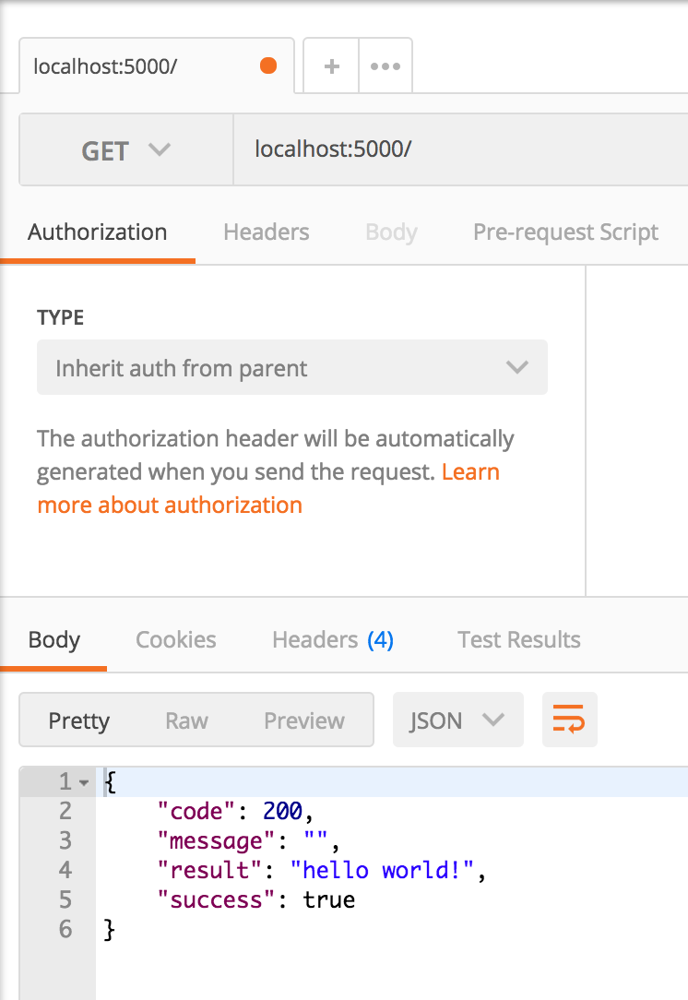
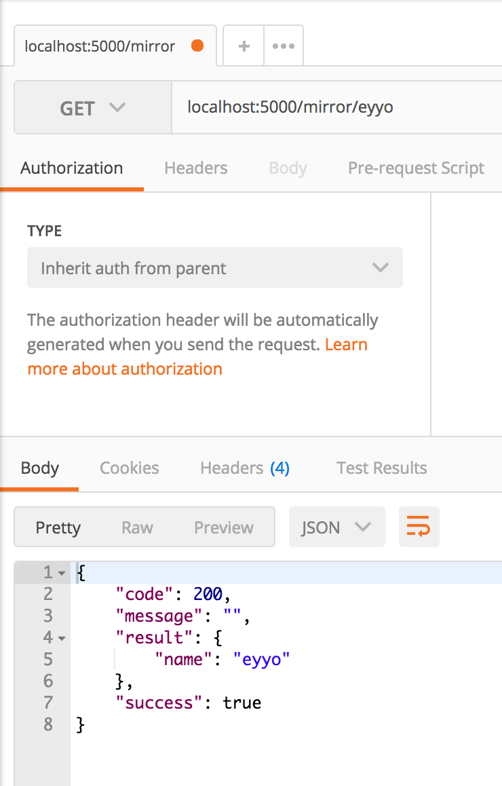
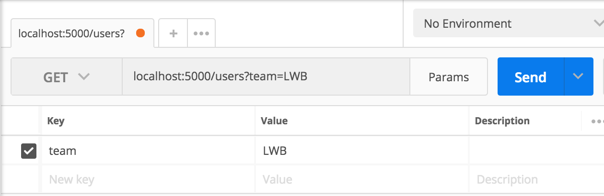
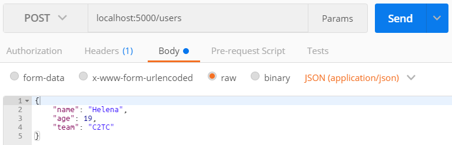

# Flask Exercise


This exercise is intended for you to get familiar with fundamental backend/server side programming in an interactive way, as well as for you to get comfortable developing in a modern Python/Flask environment.

Reading the following will help you get a sense of the big picture when it comes to developing APIs/writing server side code, and how it fits in the context of a larger web application:

- [How the Web Works](https://medium.freecodecamp.org/how-the-web-works-a-primer-for-newcomers-to-web-development-or-anyone-really-b4584e63585c) - Read all 3 parts, especially part 3!
- [Basics of HTTP](https://egghead.io/courses/understand-the-basics-of-http)


### Requirements

- python version 3.x
- pip
- pipenv
- [Postman](https://www.getpostman.com/)

Installation instructions for [Mac](https://github.com/hack4impact-uiuc/wiki/wiki/Mac-Setup) and [Windows](https://github.com/hack4impact-uiuc/wiki/wiki/Windows-Subsystem-for-Linux-Setup#setting-up-python).

Another great resource for anything on python, including installation is [The Hitchhiker's guide to python](https://docs.python-guide.org/).

Check if you have the correct versions by running the following commands in your terminal:

```
python3 -V
```

```
pip3 -V
```


### Setup

Clone this repository (click the green button saying "Clone or Download", choose http, and copy and paste it the location `<url>` ) and go into it:

```
$ git clone https://github.com/eltan148/flask-exercise.git

```

Then, setup your virtual environment and install the python dependencies required to run this app. We use pipenv, which automatically sets everything up, given a Pipfile and Pipfile.lock. Pipfile uses virtualenv, which is a virtual Python environment isolated from other Python projects, incapable of interfering with or being affected by other Python programs on the same machine. You are thus capable of running different versions of the same package or even different python versions.

```
cd flask-exercise

python3.11 -m venv venv  # Crear el entorno virtual en la carpeta 'venv'
source venv/bin/activate  # Activar el entorno virtual

```

Luego instalar flask
```
pip3 install flask
```


Then, to start the server run:

```
(venv)$ python3 app.py
```

Note: This will remain a running process in your terminal, so you will need to open a new tab or window to execute other commands.

To stop the server, press `Control-C`.

To exit your virtual environment, which is named `backend-exercise-[something here]`, run:

```
(backend-exercise)$ deactivate
```


### Running The Server And Calling Endpoints

Starting the server will make it a continuously running process on `localhost:5000`. In order to make requests to your server, use [Postman](https://www.getpostman.com/).

First, make a `GET` request to the `/` endpoint. Since the server is running on `localhost:5000`, the full endpoint url is `localhost:5000/`.



Try calling the `/mirror` endpoint. First, look at the code for the endpoint to see how you can specify url parameters. Then make a request on Postman to `localhost:5000/mirror/<name>`:



# Exercises

These exercises will walk you through creating a RESTful API using Flask! We don't want you to go through all the hassle of setting up a database instance, so we have created dummy data and a mock database interface to interact with it. For the sake of ease, the entire app logic minus the mockdb logic will by implemented in `app.py`. For larger projects, the API endpoints will usually be separated out into different files called `views`.

Before you start, take a good look at the `create_response` function and how it works. Make sure you follow the guidelines for how to use this function, otherwise your API will not follow the proper conventions!

Also take a look into the mock database. The initial dummy data is defined in `mockdb/dummy_data.py`. This is what will "exist" in the "database" when you start the server.

The functions defined in `mockdb/mockdb_interface.py` are how you can query the mockdb. In `app.py`, where you will be writing your API, this has been imported with the name `db`. Therefore when you write the code for your endpoints, you can call the db interface functions like `db.get('users')`.

When you modify your code, the server will automatically update, _unless_ your code doesn't compile, in which case the server will stop running and you have to manually restart it after fixing your code.

## Part 1

Define the endpoint:

```
GET /users
```

This should return a properly formatted JSON response that contains a list of all the `user`s in the mockdb. If you call this endpoint immediately after starting the server, you should get this response in Postman:

```
{
  "code": 200,
  "message": "",
  "result": {
    "users": [
      {
        "age": 19,
        "id": 1,
        "name": "Aria",
        "team": "LWB"
      },
      {
        "age": 20,
        "id": 2,
        "name": "Tim",
        "team": "LWB"
      },
      {
        "age": 23,
        "id": 3,
        "name": "Varun",
        "team": "NNB"
      },
      {
        "age": 24,
        "id": 4,
        "name": "Alex",
        "team": "C2TC"
      }
    ]
  },
  "success": true
}
```

## Part 2

Define the endpoint:

```
GET /users/<id>
```

This should retrieve a single user that has the `id` provided from the request.

If there doesn't exist a user with the provided `id`, return a `404` with a descriptive `message`.

## Part 3

Extend the first `/users` enpoint by adding the ability to query the users based on the team they are on. You should _not_ use a url parameter like you did in Part 2. Instead, use a [query string](https://en.wikipedia.org/wiki/Query_string).

If `team` is provided as a query string parameter, only return the users that are in that team. If there are no users on the provided `team`, return an empty list.

For this exercise, you can ignore any query string parameters other than `team`.

In Postman, you can supply query string parameters writing the query string into your request url or by hitting the `Params` button next to `Send`. Doing so will automatically fill in the request url.

The following should happen

```
GET /users?team=LWB

{
  "code": 200,
  "message": "",
  "result": {
    "users": [{
      "age": 19,
      "id": 1,
      "name": "Aria",
      "team": "LWB"
    }, {
      "age": 20,
      "id": 2,
      "name": "Tim",
      "team": "LWB"
    }]
  },
  "success": true
}
```



## Part 4

Define the endpoint:

```
POST /users
```

This endpoint should create a new user. Each request should also send a `name`, `age`, and `team` parameter in the request's `body`. The `id` property will be created automatically in the mockdb.

A successful request should return a status code of `201` and return the newly created user.

If any of the three required parameters aren't provided, DO NOT create a new user in the db and return a `422` with a useful `message`. In general, your messages should provide the user/developer useful feedback on what they did wrong and how they can fix it.

This is how you can send `body` parameters from Postman. Make sure you don't mistake this for query parameters!


## Part 5

Define the endpoint:

```
PUT /users/<id>
```

Here we need to provide a user's `id` since we need to specify which user to update. The `body` for this request should contain the same attributes as the `POST` request from Part 4.

However, the difference with this `PUT` request is that only values with the provided keys (`name`, `age`, `team`) will be updated, and any parameters not provided will not change the corresponding attribute in the user being updated.

You do not need to account for `body` parameters provided that aren't `name`, `age`, or `team`.

If the user with the provided `id` cannot be found, return a `404` and a useful `message`.

## Part 6

Define the endpoint:

```
DELETE /users/<id>
```

This will delete the user with the associated `id`. Return a useful `message`, although nothing needs to be specified in the response's `result`.

If the user with the provided `id` cannot be found, return a `404` and a useful `message`.

## Part 7 - Tests

Let's write unit tests! Unit tests are very important to software development. It enables to automatically check whether our functionality works or not since manually testing everything is very slow and error prone. Test Driven Development is a software development process in which we define a specification, write tests to that spec, then implement the functionality, and use the tests to validate whether it works. We've done a bit of that for you as the tests for Part 1-3 are written. To test them:

```
pipenv install --dev
pipenv run pytest
```

If your changes worked, you should see a green line saying `5 passed`. If they don't, follow the stack traces and fix your implementation. _Once they work, let's write tests for the Parts 3-6_.

We use [pytest](https://docs.pytest.org/en/latest/), a useful python test framework that automatically finds and runs python methods that start with `test`, such as `test_get_index`. In our case, we have a test file named `test_app.py`, which holds all the tests for Parts 1-3.

Each method also accepts a `client` object, which is automatically injected by pytest. `client` is a [test fixture](https://docs.pytest.org/en/latest/fixture.html#conftest-py-sharing-fixture-functions), which is something that you may use in multiple tests, giving you a fixed baseline for your tests. When initializing, pytest looks into `conftest.py` and collects all fixtures. In our case, we have a `client` fixture, which gives a flask test client, which we can use to easily test our API. Look into how you can use the [Flask test client](http://flask.pocoo.org/docs/1.0/api/#test-client) to make other types of requests and how you can use the request payload.


## Solución

### **Understanding the Exercise**

The exercise involves creating a RESTful API using Flask without the need to set up a real database. Instead, you'll use a mock database provided in the repository. You'll implement the API logic in `app.py`, and interact with the mock database using the functions provided in `mockdb/mockdb_interface.py`.

### **Step-by-Step Guide**

#### **1. Clone the Repository**

First, clone the GitHub repository to your local machine:

```bash
git clone https://github.com/eltan148/flask-exercise.git
```

#### **2. Install Dependencies**

Navigate to the project directory and install the required Python packages:

```bash
cd flask-exercise
pip install -r requirements.txt
```

#### **3. Explore the Project Structure**

- **`app.py`**: This is where you'll write your API endpoints.
- **`mockdb/dummy_data.py`**: Contains initial dummy data for the mock database.
- **`mockdb/mockdb_interface.py`**: Provides functions to interact with the mock database.
- **`utils.py`**: Contains the `create_response` function, which standardizes API responses.

#### **4. Understand the `create_response` Function**

Before writing your endpoints, look at the `create_response` function in `utils.py`:

```python
def create_response(data=None, status=200, message=''):
    # Function implementation
```

This function helps you return consistent responses from your API. Make sure to use it in all your endpoints.

#### **5. Review the Mock Database Interface**

In `mockdb/mockdb_interface.py`, you'll find functions like:

- `db.get(table_name)`
- `db.getById(table_name, id)`
- `db.create(table_name, data)`
- `db.updateById(table_name, id, data)`
- `db.deleteById(table_name, id)`

These functions allow you to interact with the mock database.

#### **6. Start Implementing API Endpoints in `app.py`**

Import necessary modules at the top of `app.py`:

```python
from flask import Flask, request
from mockdb import mockdb_interface as db
from utils import create_response
```

Initialize the Flask app:

```python
app = Flask(__name__)
```

#### **7. Implement CRUD Operations**

##### **a. Get All Users**

```python
@app.route('/users', methods=['GET'])
def get_all_users():
    users = db.get('users')
    return create_response({'users': users})
```

##### **b. Get a User by ID**

```python
@app.route('/users/<int:user_id>', methods=['GET'])
def get_user_by_id(user_id):
    user = db.getById('users', user_id)
    if user:
        return create_response(user)
    else:
        return create_response(status=404, message='User not found')
```

##### **c. Create a New User**

```python
@app.route('/users', methods=['POST'])
def create_new_user():
    data = request.get_json()
    if not data or not data.get('name') or not data.get('age'):
        return create_response(status=400, message='Name and age are required')
    new_user = db.create('users', data)
    return create_response(new_user, status=201)
```

##### **d. Update an Existing User**

```python
@app.route('/users/<int:user_id>', methods=['PUT'])
def update_user(user_id):
    data = request.get_json()
    updated_user = db.updateById('users', user_id, data)
    if updated_user:
        return create_response(updated_user)
    else:
        return create_response(status=404, message='User not found')
```

##### **e. Delete a User**

```python
@app.route('/users/<int:user_id>', methods=['DELETE'])
def delete_user(user_id):
    deleted = db.deleteById('users', user_id)
    if deleted:
        return create_response(message='User deleted')
    else:
        return create_response(status=404, message='User not found')
```

#### **8. Handle Query Parameters**

If you want to allow filtering users based on query parameters (e.g., name or age):

```python
@app.route('/users', methods=['GET'])
def get_users():
    users = db.get('users')
    name = request.args.get('name')
    age = request.args.get('age')

    if name:
        users = [user for user in users if user['name'] == name]
    if age:
        users = [user for user in users if user['age'] == int(age)]

    return create_response({'users': users})
```

#### **9. Run the Flask Application**

At the bottom of `app.py`, ensure you have:

```python
if __name__ == '__main__':
    app.run(debug=True)
```

Run the app:

```bash
python app.py
```

#### **10. Test Your API**

Use tools like **Postman** or **curl** to test your endpoints.

- **Get All Users**

  ```bash
  curl http://localhost:5000/users
  ```

- **Get User by ID**

  ```bash
  curl http://localhost:5000/users/1
  ```

- **Create a New User**

  ```bash
  curl -X POST -H "Content-Type: application/json" -d '{"name": "Alice", "age": 28}' http://localhost:5000/users
  ```

- **Update a User**

  ```bash
  curl -X PUT -H "Content-Type: application/json" -d '{"name": "Alice Smith", "age": 29}' http://localhost:5000/users/1
  ```

- **Delete a User**

  ```bash
  curl -X DELETE http://localhost:5000/users/1
  ```

#### **11. Automatic Server Reload**

The Flask app is set to automatically reload when you save changes to `app.py`. If there's a syntax error, fix it and restart the server.

#### **12. Additional Error Handling**

Ensure you handle errors gracefully:

- Return `400 Bad Request` if required data is missing.
- Return `404 Not Found` if the user doesn't exist.
- Validate data types (e.g., age should be an integer).

#### **13. Consistent API Responses**

Always use the `create_response` function to return data. This ensures consistency and proper formatting.

#### **14. Read the MockDB Interface Code**

Understanding `mockdb/mockdb_interface.py` will help you use it effectively. The functions simulate database operations.

#### **15. Follow RESTful Conventions**

- Use the correct HTTP methods:
  - GET for retrieving data
  - POST for creating data
  - PUT for updating data
  - DELETE for deleting data
- Use meaningful URLs and status codes.

### **Example of the Complete `app.py`**

```python
from flask import Flask, request
from mockdb import mockdb_interface as db
from utils import create_response

app = Flask(__name__)

@app.route('/users', methods=['GET'])
def get_users():
    users = db.get('users')
    name = request.args.get('name')
    age = request.args.get('age')

    if name:
        users = [user for user in users if user['name'] == name]
    if age:
        users = [user for user in users if user['age'] == int(age)]

    return create_response({'users': users})

@app.route('/users/<int:user_id>', methods=['GET'])
def get_user_by_id(user_id):
    user = db.getById('users', user_id)
    if user:
        return create_response(user)
    else:
        return create_response(status=404, message='User not found')

@app.route('/users', methods=['POST'])
def create_user():
    data = request.get_json()
    if not data or not data.get('name') or not data.get('age'):
        return create_response(status=400, message='Name and age are required')
    new_user = db.create('users', data)
    return create_response(new_user, status=201)

@app.route('/users/<int:user_id>', methods=['PUT'])
def update_user(user_id):
    data = request.get_json()
    updated_user = db.updateById('users', user_id, data)
    if updated_user:
        return create_response(updated_user)
    else:
        return create_response(status=404, message='User not found')

@app.route('/users/<int:user_id>', methods=['DELETE'])
def delete_user(user_id):
    deleted = db.deleteById('users', user_id)
    if deleted:
        return create_response(message='User deleted')
    else:
        return create_response(status=404, message='User not found')

if __name__ == '__main__':
    app.run(debug=True)
```

